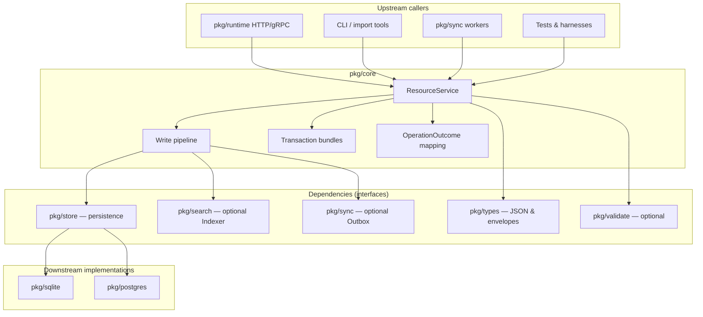

# haistack-core (`pkg/core`)

FHIR resource lifecycle kernel for the haistack monorepo.

## What it does

`pkg/core` is the **brain for FHIR resource operations**. It knows the rules for creating, reading, updating, and deleting FHIR resources — but it does **not** talk to HTTP or a specific database directly.

Think of it as a layer between your API/server and your storage:

```
HTTP handler (future)  →  pkg/core  →  pkg/store  →  SQLite or Postgres
```

When you save a FHIR resource (like a Patient), core handles the boring but important parts:

1. **Normalizes** the JSON so it is consistent
2. **Optionally validates** it (if you plug in a validator)
3. **Assigns or checks IDs** (uses your ID if valid, otherwise generates a UUID)
4. **Assigns a new version** (`meta.versionId`, `meta.lastUpdated`)
5. **Computes a content hash**
6. **Saves everything atomically**:
   - current resource
   - history entry
   - search index (optional)
   - sync/outbox event (optional)

If anything fails, the whole write is rolled back — no half-written data.

It also supports:

- **Read** — get the current version of a resource
- **History** — get all past versions of one resource
- **Transaction bundles** — create/update/delete multiple resources in one atomic operation
- **Errors → OperationOutcome** — turn Go errors into FHIR error responses

It does **not** store data itself, parse search queries, or serve HTTP. It orchestrates lifecycle rules on top of `pkg/store`.

## How it fits in the ecosystem

`pkg/core` sits in the middle of the haistack stack: handlers and CLIs call **into** core; core calls **down** into storage contracts and optional collaborators. Nothing in core imports SQLite or Postgres directly — only `pkg/store` interfaces.



| Direction | Package / layer | Relationship to `pkg/core` |
|-----------|-----------------|---------------------------|
| **Upstream** | `pkg/runtime` | Wires `ResourceService` with stores, validator, indexer, and outbox for API writes |
| **Upstream** | Application / CLI | Calls `Create`, `Read`, `Update`, `Delete`, `History`, `VRead`, `ProcessTransactionBundle` |
| **Upstream** | `pkg/types` | Supplies `ResourceEnvelope`, codec, reference extraction used during writes |
| **Peer (optional)** | `pkg/validate` | Implements `validate.Validator`; core invokes before ID/version mutation |
| **Peer (optional)** | `pkg/search` | Implements `search.Indexer`; core invokes after persist inside the session |
| **Peer (optional)** | `pkg/sync` | `Outbox` appends `store.ResourceEvent` through the write session |
| **Downstream** | `pkg/store` | **Required** — `ResourceStore`, `HistoryStore`, `WriteSessionProvider` |
| **Downstream** | `pkg/sqlite` / `pkg/postgres` | Concrete `WriteSessionProvider` + read stores (core assigns versions on SQLite path; Postgres server path may use adapter helpers separately) |
| **Downstream** | Future HTTP layer | Maps `OperationOutcomeFromError` and typed errors to status codes |

Data flows **in** as FHIR JSON envelopes, passes through normalization and optional validation, then flows **out** to the session (resource + history + events + index) in one commit.

## Usage modes

### Embedded device server (SQLite + core)

**When:** Offline-first tablet, workstation, or edge node where one process owns the database file and you want FHIR lifecycle rules without duplicating versioning logic.

**How:** Open `sqlite.DB`, pass `ResourceStore()`, `HistoryStore()`, and the DB itself as `Sessions` into `NewResourceService`. Core generates `versionId` and updates `meta` on each write; SQLite persists via `BeginWrite` inside core.

```go
db, _ := sqlite.OpenAndMigrate(ctx, "/var/haistack/local.db")
svc, _ := core.NewResourceService(core.ResourceServiceConfig{
    Resources: db.ResourceStore(),
    History:   db.HistoryStore(),
    Sessions:  db,
})
```

### Multi-tenant cloud API (Postgres + core)

**When:** A shared server where many tenants sync through the same Postgres cluster and API handlers should not embed SQL or version policy.

**How:** Obtain `tdb := pgDB.Tenant(tenantID)` and wire the tenant’s stores into `ResourceService`. Reads use connection-scoped stores; writes run in `tdb.BeginWrite()` sessions that core opens and commits.

```go
tdb := pgDB.Tenant("acme-clinic")
svc, _ := core.NewResourceService(core.ResourceServiceConfig{
    Resources: tdb.ResourceStore(),
    History:   tdb.HistoryStore(),
    Sessions:  tdb,
    Validator: validate.NewCoreValidator(eng, validate.ValidateOptions{}),
})
```

### Validation-heavy write path

**When:** Every create/update must be rejected with structured `OperationOutcome` issues before any database mutation (runtime API default pattern).

**How:** Construct `validate.NewEngine`, wrap with `validate.NewCoreValidator`, and set `ResourceServiceConfig.Validator`. Failed validation returns `ErrorKindInvalid` without opening a committing write.

### Search indexing on every successful write

**When:** You maintain typed search index rows (`store.SearchIndexEntry`) derived from FHIR content and want them updated atomically with the resource.

**How:** Implement or wire `search.Indexer` (runtime provides bridges). Core calls the indexer **inside** the write session after resource and history persist, before commit.

### Sync and change notification

**When:** Downstream sync workers consume an ordered change feed and need events in the same transaction as the resource write.

**How:** Configure `ResourceServiceConfig.Outbox` (for example `hasync.EventStoreOutbox` targeting the session’s `EventStore`). Core appends create/update/delete events with content hashes on success only.

### Transaction bundles (batch atomic writes)

**When:** A client sends a FHIR `Bundle` with `type=transaction` and multiple POST/PUT/DELETE entries that must all succeed or all roll back.

**How:** Pass the bundle envelope to `ProcessTransactionBundle`. Core resolves intra-bundle references, runs the same write pipeline per entry, and commits one session. Batch and search bundles are rejected with `not-supported`.

### Historical read (`VRead`) and filtered history

**When:** Clients request `Patient/123/_history/v2` or instance history with `_since` / `_at` filters.

**How:** Use `VRead(ctx, resourceType, id, versionID)` for a single version (deleted versions → gone). Use `History` plus `FilterHistory` helpers for time-bounded lists without hitting the database layer directly from handlers.

### Direct store access without core (anti-pattern for apps)

**When:** Low-level migration scripts or store contract tests that intentionally bypass business rules.

**How:** Call `store.ResourceStore` methods directly. **Do not** use this for product CRUD — you will skip validation, versioning, referential integrity, and outbox indexing that core centralizes.

## Limits

- HTTP routes or REST server
- Search query parsing (`GET /Patient?name=...`)
- CapabilityStatement generation
- System-wide `_history` (per-resource history only)

## When to use it

- Building a **FHIR server** or API — handlers call `ResourceService` instead of writing DB logic themselves
- Running on **device (SQLite)** or **server (Postgres)** — same core code, different storage backend
- Needing **consistent versioning, history, and rollback** without reimplementing it in every endpoint

## Usage

Wire up storage, create a `ResourceService`, and call methods:

```go
import (
    "context"

    "github.com/degoke/haistack/pkg/core"
    hasync "github.com/degoke/haistack/pkg/sync"
    "github.com/degoke/haistack/pkg/types"
)

// 1. Wire up storage (example: local SQLite)
svc, err := core.NewResourceService(core.ResourceServiceConfig{
    Resources: db.ResourceStore(), // for reads
    History:   db.HistoryStore(), // for history reads
    Sessions:  db,                 // for atomic writes (sqlite.DB or postgres.TenantDB)
    Outbox:    &hasync.EventStoreOutbox{}, // optional: emit change events
    // Validator: myValidator,       // optional
    // Indexer:   myIndexer,         // optional
})
if err != nil {
    // handle config error
}

ctx := context.Background()

// 2. Create a Patient
created, err := svc.Create(ctx, &types.ResourceEnvelope{
    ResourceType: "Patient",
    JSON:         []byte(`{"resourceType":"Patient","name":[{"family":"Doe"}]}`),
})
// created.ID and created.VersionID are set by core

// 3. Read it back
patient, err := svc.Read(ctx, "Patient", created.ID)

// 4. Update it
updated, err := svc.Update(ctx, &types.ResourceEnvelope{
    ResourceType: "Patient",
    ID:           created.ID,
    JSON:         updatedJSON,
})

// 5. Delete it
err = svc.Delete(ctx, "Patient", created.ID)

// 6. Get version history
versions, err := svc.History(ctx, "Patient", created.ID)

// 6b. Read one historical version (vread)
atVersion, err := svc.VRead(ctx, "Patient", created.ID, created.VersionID)

// 7. Handle errors for an API response
if err != nil {
    outcome := core.OperationOutcomeFromError(err)
    // return outcome as JSON to the client
}
```

**Transaction bundle** (multiple writes in one atomic session):

```go
resp, err := svc.ProcessTransactionBundle(ctx, &types.ResourceEnvelope{
    ResourceType: "Bundle",
    JSON:         transactionBundleJSON,
})
```

**Referential integrity toggle** (HAPI-style `enforceReferentialIntegrityOnWrite`):

```go
skipRefs := false
svc, _ := core.NewResourceService(core.ResourceServiceConfig{
    Resources: db.ResourceStore(),
    History:   db.HistoryStore(),
    Sessions:  db,
    EnforceReferentialIntegrity: &skipRefs, // default nil/true checks local typed refs
})
```

**Branch on typed errors in handlers:**

```go
if core.IsNotFound(err) {
    // 404
} else if core.IsConflict(err) {
    // 409 version or duplicate id
}
```

## Required vs optional pieces

| Piece | Required? | Purpose |
|-------|-----------|---------|
| `Resources` | Yes | Read current resources |
| `History` | Yes | Read version history |
| `Sessions` | Yes | Atomic writes (`sqlite.DB` or `postgres.TenantDB`) |
| `IDPolicy` | No | Defaults to FHIR id syntax + UUID generation |
| `Codec` | No | Defaults to `types.NewJSONCodec()` |
| `Validator` | No | Check resource before save |
| `Indexer` | No | Update search tables |
| `Outbox` | No | Emit change events for sync |

## Mental model

**`pkg/core` is “how FHIR resources live and change.”** You plug in storage and optional validation/search/sync; it runs the lifecycle rules for you.

## Where it fits

| Layer | Role |
|-------|------|
| **types** | Canonical JSON and `ResourceEnvelope` |
| **store** | Persistence contracts and write sessions |
| **core** | CRUD, history, versioning, transaction bundles |
| **validate** | Optional pre-write validation contract |
| **search** | Optional index extraction contract |
| **sync** | Optional outbox/event emission contract |
| **sqlite / postgres** | Concrete storage backends |

## Error handling

Core returns typed errors (`invalid`, `conflict`, `not-found`, `not-supported`, `exception`). Map them to FHIR responses with:

```go
outcome := core.OperationOutcomeFromError(err)
```

Helpers `core.IsNotFound(err)` and `core.IsConflict(err)` are available for branching in handlers.

## Related docs

- [pkg/store/README.md](../store/README.md) — persistence contracts
- [pkg/types/README.md](../types/README.md) — `ResourceEnvelope`
- [pkg/http/README.md](../http/README.md) — REST adapter over core
- [docs/architecture.md](../../docs/architecture.md) — write path
- [doc.go](./doc.go) — full API and bundle rules
