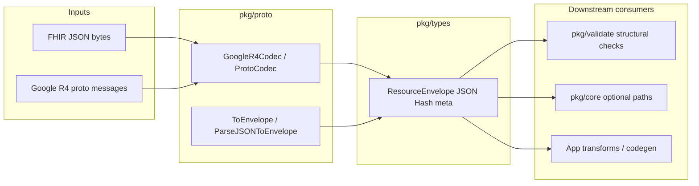

# haistack-proto (`pkg/proto`)

Optional typed protobuf adapter for FHIR resources in the haistack monorepo.

## What it does

FHIR resources in this stack normally live as **JSON**. That is what gets stored and passed around via `pkg/types`.

This package adds an **optional typed layer** on top. It converts FHIR JSON into **Google FHIR Go protobuf objects** (strongly typed structs under the hood) and back again — without forcing the rest of your code to import Google's libraries.

Think of it as a **translator**:

```
FHIR JSON  ↔  typed proto (in memory)  ↔  ResourceEnvelope
```

Important rules:

- **JSON is still the source of truth** for storage
- **`pkg/types` is still the shared container** (`ResourceEnvelope`)
- **Proto is a companion** — useful for validation and transformation, not a replacement for JSON

It does **not** store data, persist proto blobs, or replace JSON in the database. It only converts between JSON and typed proto values in memory.

## How it fits in the ecosystem

`pkg/proto` is an **optional typed companion** to `pkg/types`. Storage, APIs, and sync continue to exchange canonical JSON in `ResourceEnvelope.JSON`; proto values live in `envelope.Proto` for in-memory validation, transformation, and tooling.



| Direction | Package | Relationship |
|-----------|---------|--------------|
| **Upstream** | Callers / CLI | Supply JSON or typed `pkg/proto/r4` builders |
| **Foundation** | `pkg/types` | All metadata (`Hash`, `ID`, `VersionID`) derived from canonical JSON via `JSONCodec` |
| **Downstream** | `pkg/validate` | Reuses attached proto when hash matches JSON to skip re-parse |
| **Downstream** | `pkg/core` | Accepts envelopes with or without `Proto`; persistence stores JSON only |
| **Downstream** | `pkg/store` | Persists `ResourceEnvelope.JSON`; proto not written in MVP |
| **External** | `github.com/google/fhir/go` | R4 jsonformat + generated messages (pinned version) |
| **Subpackage** | `pkg/proto/r4` | Ergonomic aliases and helpers (`NewPatient`, etc.) |

JSON→proto conversion **rejects unknown JSON fields** relative to the Google R4 schema. Vendor extensions that must round-trip unchanged should stay on the `pkg/types` JSON-only path.

## Usage modes

### JSON-only envelopes (default stack path)

**When:** Storage, sync, and APIs already normalize JSON through `pkg/types` and you do not need typed structs in process.

**How:** Skip `pkg/proto` entirely. `envelope.Proto` remains `nil`. Validation still works via JSON parse inside `pkg/validate`.

### Parse JSON to typed proto for inspection

**When:** Tools or tests want compile-time-friendly structs and Google’s parser validation without persisting proto.

**How:** `codec := proto.NewGoogleR4Codec()` then `ParseJSONToProto("Patient", data)`. Use `ResourceTypeOfProto` before branching on message type.

### Build resources in Go, export canonical JSON

**When:** Server-side builders, codegen, or migrations construct FHIR programmatically.

**How:** Use `pkg/proto/r4` helpers, then `proto.ToEnvelope` or `proto.ToJSON`:

```go
patient := protor4.NewPatient("pat-1")
jsonBytes, err := proto.ToJSON(patient)
envelope, err := proto.ToEnvelope(patient)
```

### One-step JSON envelope with proto attached

**When:** Ingest pipeline wants both canonical envelope fields and typed proto for downstream validators.

**How:** `proto.ParseJSONToEnvelope("Patient", patientJSON)` or `codec.ParseJSONToEnvelope`. Hash and meta match the JSON-only codec path; `Proto` holds `ContainedResource`.

### Unwrap proto from stored envelopes

**When:** A resource was loaded from DB as JSON-only but you re-parse for analysis, or envelope was built on the proto path earlier in the request.

**How:** `cr, err := proto.ContainedResourceFromEnvelope(envelope)` then `cr.GetPatient()`. Guard with `proto.IsProtoResource(envelope.Proto)`.

### Validation fast path with proto reuse

**When:** `pkg/validate` runs on envelopes that already carry consistent proto + hash from ingest.

**How:** Populate envelope via proto path before calling `validate.Engine.Validate` — structural validation may skip jsonformat re-parse when hash matches canonical JSON.

### Round-trip JSON → proto → JSON for strict R4 subsets

**When:** You need normalized output that drops non-schema fields (interop with strict Google R4 tooling).

**How:** `ParseJSONToProto` → `ProtoToJSON`. Expect field loss for extensions not modeled in Google R4; compare hash with `types` normalization expectations before save.

## When to use it

Use `pkg/proto` when you want to:

1. **Parse JSON into a typed proto** — Google's parser validates structure as it parses
2. **Convert proto back to canonical JSON** — same normalized format `pkg/types` expects
3. **Build a full envelope with both JSON and proto attached** — hash and metadata from JSON, typed object in `envelope.Proto`

You **do not** need it for basic JSON handling — that is what `pkg/types` is for.

## Usage

**Construct a typed resource and create an envelope:**

```go
import (
	proto "github.com/degoke/haistack/pkg/proto"
	protor4 "github.com/degoke/haistack/pkg/proto/r4"
)

patient := protor4.NewPatient("pat-1")
envelope, err := proto.ToEnvelope(patient)
// envelope.JSON is canonical; envelope.Proto is the original patient.
```

For explicit resource-type control or JSON parsing, use a codec:

```go
import "github.com/degoke/haistack/pkg/proto"

codec := proto.NewGoogleR4Codec()
```

**Parse JSON into proto:**

```go
pb, err := codec.ParseJSONToProto("Patient", patientJSON)
// pb is an `any` — a typed Google R4 ContainedResource inside
```

**Parse JSON into a full envelope in one step:**

```go
envelope, err := codec.ParseJSONToEnvelope("Patient", patientJSON)
// Same as ParseJSONToProto + ProtoToEnvelope
// Or use the package helper: proto.ParseJSONToEnvelope("Patient", patientJSON)
```

**Unwrap the typed proto from an envelope:**

```go
cr, err := proto.ContainedResourceFromEnvelope(envelope)
patient := cr.GetPatient()
```

**Convert proto back to canonical JSON:**

```go
jsonBytes, err := codec.ProtoToJSON("Patient", pb)
// Same normalized JSON rules as pkg/types
```

**Get a full envelope (JSON + metadata + proto attached):**

```go
envelope, err := codec.ProtoToEnvelope("Patient", pb)
// envelope.JSON, envelope.Hash, envelope.ID, ...
// envelope.Proto holds the original typed value
```

**Check what you have:**

```go
if proto.IsProtoResource(envelope.Proto) {
    rt, _ := proto.ResourceTypeOfProto(envelope.Proto) // "Patient"
}
```

When `resourceType` is non-empty, it must match the payload (for example `"Patient"`). Pass `""` to accept whatever type is in the JSON or proto.

**Wrap an individual R4 message as ContainedResource:**

```go
cr, err := proto.AsContainedResource(patientMsg)
```

**Detect type mismatch early:**

```go
_, err := codec.ParseJSONToEnvelope("Observation", patientJSON) // error: type mismatch
```

## Mental model

| Package | Role |
|---------|------|
| **types** | Works with FHIR as JSON — parse, hash, read id/meta |
| **proto** | Optionally adds typed proto companions on top of that JSON |

```
Patient JSON
    │
    ├─ pkg/types only ──► ResourceEnvelope { JSON, Hash, ... }     Proto = nil
    │
    └─ pkg/proto path ──► ResourceEnvelope { JSON, Hash, ... }     Proto = typed object
```

**One-liner:** `pkg/types` handles FHIR JSON; `pkg/proto` optionally gives you a typed proto version of the same resource, while keeping JSON as the canonical form everywhere else.

## Where it fits

| Layer | Role |
|-------|------|
| **types** | Canonical JSON, envelopes, field helpers |
| **proto** | Optional typed proto companions on envelopes |
| **store** | Persistence contracts using `ResourceEnvelope` |
| **core** | Resource lifecycle (CRUD, history, bundles) |

## Limits

- Google FHIR Go R4 only (no R5 yet)
- No proto blob storage in the database
- No profile-aware validation or proto diffing
- `pkg/proto/r4` aliases the pinned Google R4 message types, while JSON remains canonical
- `envelope.Proto` is set on proto paths; JSON-only paths leave it nil
- JSON→proto→JSON may reject or omit fields outside the Google R4 schema; use pkg/types for arbitrary JSON

## Related docs

- [pkg/types/README.md](../types/README.md) — canonical JSON envelope
- [pkg/fhirpath/README.md](../fhirpath/README.md) — proto codec for evaluation
- [doc.go](./doc.go) — conversion flows
