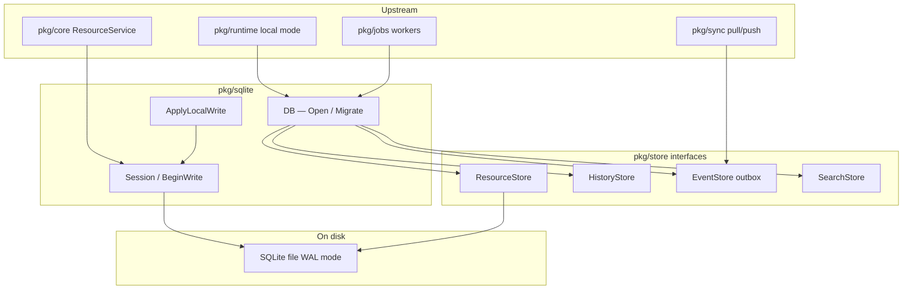

# haistack-sqlite (`pkg/sqlite`)

Embedded offline database for haistack local deployments.

## What it does

**haistack-sqlite** is the **local database** for haistack. It saves FHIR resources and related data to a **SQLite file on disk** — on a device, tablet, workstation, or small edge node — so the app works **offline**.

Think of it as: *save Patient/Observation JSON locally, keep history, index for lookup, and queue changes for sync — all in one place.*

When you save a resource, SQLite keeps several things in sync:

| Piece | What it is |
|-------|------------|
| **Current resource** | Latest version of each Patient, Observation, etc. |
| **History** | Every past version (including deletes) |
| **Search index** | Fast lookup by field (e.g. family name → patient IDs) |
| **Outbox** | A log of local changes, for sync later |
| **Cursors** | “Where did the sync worker leave off?” checkpoints |

It also has tables for conflicts, small binaries, module metadata, inbox
idempotency, background jobs, and audit logs. The main job is **local FHIR
persistence + sync prep**.

It implements the **`pkg/store` interfaces** on top of SQLite. Other code depends on `store.ResourceStore`, not on SQLite directly. Background workers use `DB.JobStore()` with `pkg/jobs`; audit emitters use `DB.AuditStore()` with `pkg/audit`.

It does **not**:

- Parse FHIR or assign version numbers (`pkg/types`, `pkg/core`, etc.)
- Run FHIR search queries (only stores pre-built index entries)
- Talk to the cloud (sync layers read the outbox)
- Replace Postgres for multi-tenant/cloud (`pkg/postgres`)

## How it fits in the ecosystem

`pkg/sqlite` is the **embedded adapter** that makes `pkg/store` real on disk. Device runtimes, tests, and edge nodes open a single file (or `:memory:`), run migrations, and expose the same interfaces Postgres provides — with local outbox semantics instead of a global event log.



| Direction | Package | Relationship |
|-----------|---------|--------------|
| **Upstream** | `pkg/core` | Uses `sqlite.DB` as `WriteSessionProvider` + read stores; core owns version IDs on this path |
| **Upstream** | `pkg/runtime` | Opens DB path from config, runs migrations, wires local persistence |
| **Upstream** | `pkg/sync` | Reads `OutboxStore` / `EventStore`, writes `InboxStore`, updates `CursorStore` |
| **Upstream** | `pkg/jobs` | Claims work from `JobStore` backed by SQLite tables |
| **Upstream** | `pkg/audit` | Appends via `AuditStore` |
| **Contract** | `pkg/store` | All public store methods implement these interfaces |
| **Peer** | `pkg/postgres` | Server counterpart — devices sync accepted writes upward |
| **Downstream** | `modernc.org/sqlite` | Pure Go driver; pragmas: foreign keys, WAL, busy timeout |

Local writes are **caller-versioned**: unlike Postgres, SQLite does not assign `versionId` inside the adapter — `pkg/core` or your pipeline must supply `ResourceVersion` and events when using `ApplyLocalWrite` directly.

## Usage modes

### One-shot open and migrate (production local DB)

**When:** Application startup on a device needs a durable file and idempotent schema.

**How:** Prefer `OpenAndMigrate` or `Open` followed by `Migrate`. Re-open the same path after restart; migrations are safe to re-run.

```go
db, err := sqlite.OpenAndMigrate(ctx, cfg.DataDir+"/haistack.db", sqlite.WithBusyTimeout(5*time.Second))
```

### In-memory database for tests

**When:** Fast integration tests that need real SQL and transactions without file cleanup.

**How:** `sqlite.Open(":memory:")` then `Migrate`. Close the DB when the test finishes; the database disappears with the connection unless shared-cache options are used.

### High-level local write (`ApplyLocalWrite`)

**When:** A sync agent or custom pipeline already computed version metadata and search entries and needs atomic persistence.

**How:** Bundle resource, `store.ResourceVersion`, `store.ResourceEvent`, and `[]store.SearchIndexEntry` into `sqlite.LocalWrite`. One call updates resource, history, outbox, and search tables or rolls back entirely.

### Core-orchestrated writes (recommended for FHIR CRUD)

**When:** You want validation, UUID version IDs, referential integrity, optional indexing, and outbox events without hand-assembling `LocalWrite`.

**How:** Wire `sqlite.DB` into `core.NewResourceService` and call `Create`/`Update`/`Delete`. Core opens `BeginWrite` sessions internally — you rarely call `ApplyLocalWrite` from handlers.

### Manual `BeginWrite` sessions

**When:** Custom multi-step logic must share a transaction with resource persistence (for example terminology projection hooks on sessions that implement extra interfaces).

**How:** Same pattern as `pkg/store` write sessions: obtain stores from the session, commit once at the end.

### Sync outbox consumption

**When:** An edge worker pushes local changes to Postgres or replays events for projections.

**How:** Use `db.OutboxStore()` (implements `store.EventStore`), `ReadSince` with the last acknowledged sequence, and `db.CursorStore()` for worker checkpoints. Conflict and inbox stores exist for pull/apply idempotency; full reconciliation policies live upstream.

### Background jobs and audit on device

**When:** Offline nodes still queue reindex work or record audit events locally.

**How:** `db.JobStore()` with `pkg/jobs` runner; `db.AuditStore()` with `pkg/audit` emit helpers. Data syncs or compacts according to product rules outside this package.

## When to use it

- Embedded local storage on a device or edge node
- Offline-first apps that need durable FHIR resource state
- Atomic local writes where resource, history, outbox, and search must stay consistent
- Tests that need a real persistence layer without Postgres

## Usage

**Open the database and run migrations:**

```go
import (
    "context"

    "github.com/degoke/haistack/pkg/sqlite"
)

db, err := sqlite.Open("/path/to/haistack.db")
if err != nil {
    // handle error
}
defer db.Close()

if err := db.Migrate(context.Background()); err != nil {
    // handle error
}
```

Use `sqlite.Open(":memory:")` for an in-memory database in tests.

**Simple reads and writes (one store at a time):**

```go
resources := db.ResourceStore()

err := resources.Create(ctx, envelope)
env, err := resources.Read(ctx, "Patient", "pat-1")
err = resources.Delete(ctx, "Patient", "pat-1")
```

Same pattern for history, search, outbox, and cursors via `db.HistoryStore()`, `db.SearchStore()`, `db.OutboxStore()`, `db.CursorStore()`, and so on.

**Full local write (recommended for creates, updates, deletes):**

When you change a resource, update current state, history, outbox event, and search index **together**. If any step fails, nothing is half-saved.

```go
import "github.com/degoke/haistack/pkg/store"

result, err := db.ApplyLocalWrite(ctx, sqlite.LocalWrite{
    Resource:      envelope, // from pkg/types
    Action:        store.VersionActionCreate,
    Version:       version,  // caller supplies version ID
    Event:         event,    // change notification for sync
    SearchEntries: []store.SearchIndexEntry{
        {
            ResourceType: "Patient",
            ID:           "pat-1",
            Fields:       map[string]string{"string.family": "Doe"},
        },
    },
})
// result.Event.Sequence is the outbox sequence number
```

**Manual transaction (same guarantee, more control):**

```go
session, err := db.BeginWrite(ctx)
if err != nil {
    // handle error
}

session.ResourceStore().Create(ctx, envelope)
session.HistoryStore().AppendVersion(ctx, version)
session.EventStore().Append(ctx, event)
session.SearchStore().Index(ctx, entry)

err = session.Commit(ctx)
```

**Replay outbox events after a local write:**

```go
outbox := db.OutboxStore()
events, err := outbox.ReadSince(ctx, 0, 50)
for _, ev := range events {
    _ = ev.Sequence // monotonic local sequence for sync cursor
}
```

**Open with busy timeout for concurrent readers/writers:**

```go
db, err := sqlite.Open(path, sqlite.WithBusyTimeout(10*time.Second))
```

## Search index field keys

`SearchStore` routes fields to typed tables using key prefixes:

| Prefix | Table |
|--------|-------|
| `token.<name>` | `search_token` |
| `string.<name>` | `search_string` |
| `date.<name>` | `search_date` |
| `number.<name>` | `search_number` |
| `reference.<name>` or `ref.<name>` | `search_reference` |
| `uri.<name>` | `search_string` |

Keys without a prefix (for example `family`) default to `search_string`. FHIR search parsing stays in `pkg/search`; this package only stores prepared entries.

## Mental model

```
pkg/types   → wrap/normalize FHIR JSON (ResourceEnvelope)
pkg/core    → business rules, version IDs, write pipeline
pkg/store   → interfaces (what “storage” means)
pkg/sqlite  → actual SQLite file + tables + atomic writes
```

**One line:** `pkg/sqlite` is the **offline filing cabinet** — it keeps resources, their history, search indexes, and a change log ready for sync, with the guarantee that a local write either fully succeeds or fully rolls back.

## Where it fits

| Layer | Role |
|-------|------|
| **types** | Canonical JSON and `ResourceEnvelope` |
| **store** | Persistence contracts |
| **sqlite** | Embedded local SQLite implementation |
| **postgres** | Tenant-scoped edge/cloud implementation |
| **core** | Orchestrates write pipelines on top of store interfaces |

## MVP limits

- Pure Go driver (`modernc.org/sqlite`); no CGO
- Canonical JSON in `ResourceEnvelope.JSON`; no proto-only storage
- Version assignment and search extraction stay outside this package
- Inbox, conflict, binary, and module stores persist data but omit full upstream workflows (sync apply, reconciliation, blob offload, module activation)
- Encrypted SQLite, backup/restore, and multi-profile DBs are out of scope

See [doc.go](./doc.go) for the full API, schema tables, and file layout.
