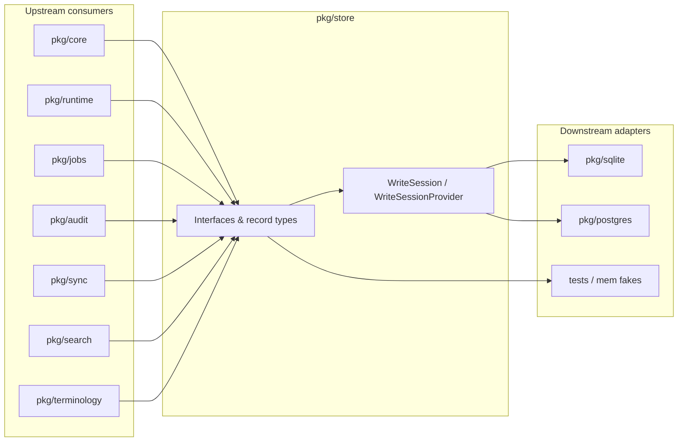

# haistack-store (`pkg/store`)

Storage contract layer for the haistack monorepo.

## What it does

Think of **`pkg/types`** as “how we represent a FHIR resource in memory.”  
**`pkg/store`** is “how we *save*, *find*, and *track changes* to those resources — without caring whether the database is SQLite, Postgres, or something else.”

This package **does not talk to a database directly**. It defines **interfaces** (contracts) such as:

- save, read, update, and delete a resource
- keep version history
- index data for search
- record change events for sync
- store files, audit logs, background jobs, and more
- store canonical terminology resources and their disposable lookup projections

Actual database code lives in separate packages (`pkg/sqlite`, `pkg/postgres`). Application code depends on **`store.ResourceStore`**, not on a specific backend. That makes it easy to swap implementations or test with in-memory fakes.

## How it fits in the ecosystem

`pkg/store` is the **persistence seam** of haistack. Higher layers depend on interfaces defined here; database packages implement them. No SQL, no HTTP, no FHIR business rules — only contracts and shared record types built on `pkg/types.ResourceEnvelope`.



| Direction | Component | Role relative to `pkg/store` |
|-----------|-----------|------------------------------|
| **Upstream** | `pkg/types` | Defines `ResourceEnvelope` — the payload every resource store method accepts |
| **Upstream** | `pkg/core` | Orchestrates multi-store writes through `WriteSession`; assigns version policy upstream of SQLite |
| **Upstream** | `pkg/runtime` | Opens backends and exposes store accessors to services |
| **Upstream** | `pkg/search` | Produces `SearchIndexEntry` values consumed by `SearchStore.Index` |
| **Upstream** | `pkg/sync` | Reads `EventStore`, updates `CursorStore`, applies `InboxStore` idempotency |
| **Upstream** | `pkg/jobs` | Uses `JobStore` for durable queue state |
| **Upstream** | `pkg/audit` | Shapes records appended to `AuditStore` |
| **Downstream** | `pkg/sqlite` | Embedded implementation: resource, history, outbox, search, jobs, audit, … |
| **Downstream** | `pkg/postgres` | Tenant-scoped server implementation with global event log and ID registry |
| **Downstream** | Test fakes | In-memory implementations in tests (`pkg/store/store_test.go`, `pkg/testkit`) |

Keeping this boundary stable lets you run the same core and runtime code against SQLite on a device and Postgres in the cloud.

## Usage modes

### Application reads and writes via `ResourceStore`

**When:** You need the latest FHIR resource for a type/id pair, or a simple CRUD path in a tool that already manages versioning elsewhere.

**How:** Obtain `store.ResourceStore` from a backend (`db.ResourceStore()` or `tdb.ResourceStore()`). Use `Create`, `Read`, `Update`, `Delete`, and `Exists`. Prefer `pkg/core` for product writes so history and events stay consistent.

### Atomic multi-table writes (`WriteSession`)

**When:** A single logical change must touch current state, history, search index, and outbox/event log together.

**How:** Call `WriteSessionProvider.BeginWrite(ctx)`, use session-scoped stores, then `Commit` or `Rollback`. Both `sqlite.DB` and `postgres.TenantDB` implement `WriteSessionProvider`.

```go
session, err := db.BeginWrite(ctx)
if err != nil { /* … */ }
defer func() { _ = session.Rollback(ctx) }()

if err := session.ResourceStore().Create(ctx, envelope); err != nil { return err }
if err := session.HistoryStore().AppendVersion(ctx, version); err != nil { return err }
if err := session.EventStore().Append(ctx, event); err != nil { return err }
return session.Commit(ctx)
```

### Sync replay and cursor checkpoints

**When:** A worker replays local or global changes since a sequence number and must resume safely after restarts.

**How:** Read with `EventStore.ReadSince(ctx, afterSequence, limit)`, process events, then persist progress with `CursorStore.UpsertCursor`. Cursors are independent of events so multiple consumers can track different positions.

```go
events, err := eventStore.ReadSince(ctx, lastSeq, 100)
// … apply or forward …
_ = cursorStore.UpsertCursor(ctx, store.Cursor{
    Name:     "edge-sync",
    Position: fmt.Sprintf("%d", events[len(events)-1].Sequence),
    UpdatedAt: time.Now(),
})
```

### Conflict and ID registry coordination

**When:** Server-side sync detects version mismatches or needs authoritative ID registration per tenant.

**How:** Append `ConflictStore` records on conflict outcomes; use `IDRegistryStore.Check`, `Reserve`, and `Register` during server write pipelines (`postgres.ApplyWrite` integrates registry on accepted creates). Reconciliation policy stays in core/sync — store only persists facts.

### Operational and compliance storage

**When:** Background reindex jobs, security audit trails, analytics events, or module registration metadata must survive process restarts.

**How:** Use `JobStore`, `AuditStore`, `AnalyticsStore`, and `ModuleStore` accessors from the backend. Scheduling semantics live in `pkg/jobs`; audit field shaping lives in `pkg/audit`.

### Terminology and definitions (server)

**When:** Canonical CodeSystem/ValueSet records and compiled lookup projections are part of tenant data.

**How:** Use `TerminologyStore` on backends that implement it (Postgres). `TerminologyWriteSession` optionally joins terminology projections to the same transaction as a resource write.

### Testing with store contracts only

**When:** Unit tests for core, search, or sync logic without spinning up SQLite/Postgres.

**How:** Implement minimal fakes satisfying the interfaces you need, or use patterns from `pkg/testkit/storetest`. Depend on `store.ResourceStore`, not concrete DB types, so tests stay portable.

## What it does not do

- Parse FHIR JSON — use `pkg/types`
- Assign version numbers or enforce business rules — use `pkg/core` or your app layer
- Parse FHIR search queries — use `pkg/search`
- Run SQL or manage schemas — use `pkg/sqlite` or `pkg/postgres`

`pkg/store` is the **middle layer**: it defines *what* can be persisted and *how* to call it. Backends decide *where* data actually goes.

## When to use it

- When writing or reading FHIR resources through a stable API
- When you need history, search indexes, or change events alongside current state
- When building sync, audit, or background-job features on top of shared storage contracts
- When you want tests to use fake stores instead of a real database

## Mental model

When a Patient is saved, several things usually happen:

1. **Current state** — store the latest Patient (`ResourceStore`)
2. **History** — remember this was version 3 (`HistoryStore`)
3. **Search index** — index `"family=Doe"` so search works (`SearchStore`)
4. **Change event** — emit “Patient/pat-1 was updated” for sync (`EventStore`)

`pkg/store` defines separate interfaces for each of those jobs, plus helpers for sync cursors, conflicts, files, audit trails, and jobs.

## Usage

**Open a backend and get a store:**

```go
import (
    "github.com/degoke/haistack/pkg/sqlite"
)

db, err := sqlite.Open(sqlite.Options{Path: "data.db"})
resources := db.ResourceStore() // satisfies store.ResourceStore
```

On a server you might use `pkg/postgres` instead — same interfaces, different backend.

**Save and read a resource:**

```go
// envelope comes from pkg/types
err := resources.Create(ctx, envelope)

patient, err := resources.Read(ctx, "Patient", "pat-1")
```

**Compose a full write (typical pattern):**

Higher-level code (or a `WriteSession`) often does all of this together:

```go
resources.Create(ctx, envelope)

history.AppendVersion(ctx, store.ResourceVersion{
    ResourceType: envelope.ResourceType,
    ID:           envelope.ID,
    VersionID:    envelope.VersionID,
    Action:       store.VersionActionCreate,
    Timestamp:    time.Now(),
    Resource:     envelope,
    Hash:         envelope.Hash,
})

events.Append(ctx, store.ResourceEvent{
    ResourceType: envelope.ResourceType,
    ID:           envelope.ID,
    VersionID:    envelope.VersionID,
    Action:       store.EventActionCreate,
    Timestamp:    time.Now(),
    Hash:         envelope.Hash,
})

search.Index(ctx, store.SearchIndexEntry{
    ResourceType: "Patient",
    ID:           "pat-1",
    Fields:       map[string]string{"family": "Doe"},
})
```

On delete: remove from `ResourceStore`, append a tombstone to history, emit a delete event, and remove from the search index.

**Read a specific history version:**

```go
ver, err := history.GetVersion(ctx, "Patient", "pat-1", "uuid-version-id")
if ver.Deleted {
    // tombstone — no Resource snapshot
}
```

**Simple search index lookup (not FHIR search parsing):**

```go
ids, err := search.Lookup(ctx, "string.family", "Doe")
```

**Sync and background work:**

- `EventStore` + `CursorStore` — replay changes and resume where you left off
- `ConflictStore` — record “local vs remote version mismatch”
- `JobStore` — queue work like reindexing
- `AuditStore` — record who did what for compliance

## Interface overview

| Interface | Purpose |
|-----------|---------|
| `ResourceStore` | Latest copy of each resource |
| `HistoryStore` | All past versions |
| `SearchStore` | Fast lookup data (not full search parsing) |
| `EventStore` | Change feed for sync and replay |
| `CursorStore` | “Where did the sync worker stop?” |
| `ConflictStore` | Record sync/write conflicts |
| `BinaryStore` | Small inline binary payloads |
| `BlobStore` | Larger blobs or external storage references |
| `MaterializedViewStore` | Read-optimized projections |
| `ReportingTableStore` | Tenant-scoped analytics reporting table snapshots |
| `AnalyticsStore` | Operational/product analytics events |
| `AuditStore` | Security/compliance audit trail |
| `JobStore` | Background task queue |
| `ModuleStore` | Registered plugins/extensions |
| `IDRegistryStore` | Authoritative ID registration |
| `WriteSessionProvider` | Atomic write across resource, history, search, and events |
| `TerminologyStore` | Canonical CodeSystem/ValueSet records and compiled projections |

## Where it fits

| Layer | Role |
|-------|------|
| **types** | Canonical JSON and `ResourceEnvelope` |
| **store** | Persistence contracts (this package) |
| **sqlite** | Embedded local implementation |
| **postgres** | Tenant-scoped edge/cloud implementation |
| **core** | Business rules and write pipelines |
| **search** | FHIR search parsing (produces index entries for `SearchStore`) |

## MVP limits

- Contracts and record types only — no database adapters in this package
- No FHIR search parsing, version assignment policy, or conflict reconciliation
- No in-memory production adapter yet (`pkg/store/memory` is future work)
- `BinaryStore`, `BlobStore`, and operational stores are defined here; not every backend implements every interface

See [doc.go](./doc.go) for the full API, design principles, typical flows, and file layout.
