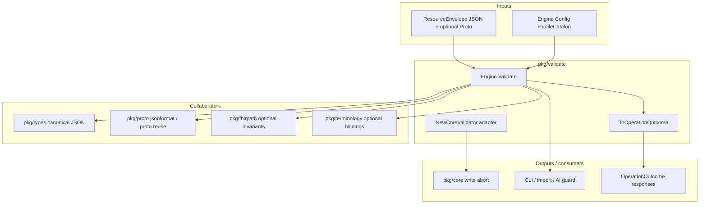

# haistack-validate (`pkg/validate`)

Built-in FHIR resource validation for haistack.

## What it does

`pkg/validate` checks FHIR resources **before** they are saved, synced, indexed, or handed to other tools. Think of it as a gatekeeper: *Is this resource well-formed enough to work with safely?*

It looks at a `*types.ResourceEnvelope` — mainly the JSON inside it — and checks things like:

- Is the JSON valid?
- Does it have a `resourceType` (e.g. `Patient`, `Observation`)?
- Is that type a known FHIR type?
- Is the `id` valid (if present)?
- Are basic required fields present (e.g. `Observation.status`)?
- Are references syntactically valid (e.g. `Patient/123`, URLs, URNs)?
- Are fields structurally sane (via Google’s FHIR JSON/proto parser — e.g. `active` must be a boolean, not a string)?

**What it does not do by default:** live terminology-server validation on API
writes or FHIRPath invariants (both opt-in). Profile cardinality, slicing, and
unknown-element checks against installed StructureDefinitions run on every write
when the runtime profile catalog is configured.

## How it fits in the ecosystem

`pkg/validate` is a **gate before side effects**. It consumes `*types.ResourceEnvelope` (JSON-first, optional proto companion) and returns structured issues or integrates with `pkg/core` as a write hook. It does not touch databases or HTTP.



| Direction | Package | Relationship |
|-----------|---------|--------------|
| **Upstream** | Handlers, CLI, import jobs | Call `Engine.Validate` directly with options per request |
| **Upstream** | `pkg/runtime` | Configures engine + `NewCoreValidator` on `ResourceService` |
| **Input** | `pkg/types` | Canonical envelope and JSON parsing rules |
| **Input** | `pkg/proto` | Structural/primitive validation via Google R4; optional proto reuse |
| **Optional** | `pkg/fhirpath` | Profile invariant evaluation when `ProfileConstraints` enabled |
| **Optional** | `pkg/terminology` | Full-mode terminology binding checks |
| **Downstream** | `pkg/core` | Validator hook runs before ID/version mutation on writes |
| **Downstream** | API clients | Receive `OperationOutcome` from `ToOperationOutcome` or `core.OperationOutcomeFromError` |

Validation is **structural and safety-oriented**, not a full HL7 Java validator replacement — but base HL7 R4 profile checks integrate when the runtime catalog is wired.

## Usage modes

### Standalone validate (CLI, import, AI guard)

**When:** You need detailed issue lists or outcomes without going through `ResourceService`.

**How:** `NewEngine`, `Validate`, branch on `result.Valid`, emit `ToOperationOutcome(result)` for API-shaped errors.

### Automatic validation on API writes (core hook)

**When:** Invalid resources must never reach SQLite/Postgres on create/update.

**How:** `Validator: validate.NewCoreValidator(eng, opts)` in `ResourceServiceConfig`. Failures become `ErrorKindInvalid` with preserved issue codes in outcomes.

### Fast profile mode (runtime default)

**When:** Production API latency matters; you still want base profile cardinality, slicing, and unknown-element checks on snapshot profiles.

**How:** Enable `EnforceBaseProfile` / `EnforceDeclaredProfiles` with default `ValidationModeFast`. Leave `ProfileConstraints` false unless you explicitly want FHIRPath invariants on every write.

### Full conformance mode (IG / certification)

**When:** Running `make validate-ig` or certification-style checks against examples.

**How:** Set `Mode: validate.ValidationModeFull`, supply `ProfileCatalog`, optional `Terminology` service, and enable extension policy checks.

### Restricted resource-type deployments

**When:** A deployment only supports a subset of FHIR types (for example Patient + Observation only).

**How:** Configure `InstalledTypes` on `Engine` config or pass `ValidateOptions.ResourceTypeRegistry` per request.

### Custom required fields beyond defaults

**When:** Organization policy mandates fields FHIR marks optional (for example `Patient.gender`).

**How:** `RequiredFields` map in `validate.Config`. Note: custom maps **replace** per-type defaults entirely — include `Observation.status` and `Bundle.type` if you still need them.

### Proto-accelerated structural validation

**When:** Ingest already parsed JSON to proto and attached it to the envelope with matching hash.

**How:** Pass the same envelope to `Validate`; engine reuses proto for jsonformat work when consistent. JSON remains authoritative if hash/proto disagree.

### Require server-assigned or client IDs at validation time

**When:** Create pipelines must reject resources missing `id` before reservation.

**How:** `ValidateOptions{RequireID: true}` on standalone or core adapter options.

## When to use it

- Before persisting a resource through `pkg/core`
- In a CLI `validate` command or import pipeline
- As a guard before exposing data to AI tools or sync

## Usage

### Standalone (CLI, import, AI guard, etc.)

Returns a structured result with a list of issues — good when you want detailed feedback or a FHIR `OperationOutcome`.

```go
import (
    "context"

    "github.com/degoke/haistack/pkg/validate"
)

eng, err := validate.NewEngine(validate.Config{})
if err != nil {
    // invalid engine config
}

result, err := eng.Validate(ctx, envelope, validate.ValidateOptions{
    RequireID: true, // optional: fail if id is missing
})
if err != nil {
    // exceptional failure (e.g. context cancelled)
}

if !result.Valid {
    for _, issue := range result.Issues {
        // issue.Code, issue.Diagnostics, issue.Expression
    }

    outcome := validate.ToOperationOutcome(result)
    // emit outcome as an API error response
}
```

### Plugged into `pkg/core` (automatic validation on writes)

Core supports an optional validator hook. Wrap the engine so invalid resources are rejected on Create/Update:

```go
import (
    "github.com/degoke/haistack/pkg/core"
    "github.com/degoke/haistack/pkg/validate"
)

eng, _ := validate.NewEngine(validate.Config{})

svc, _ := core.NewResourceService(core.ResourceServiceConfig{
    Resources: db,
    History:   db,
    Sessions:  db,
    Validator: validate.NewCoreValidator(eng, validate.ValidateOptions{}),
})
```

If validation fails, core aborts the write and returns `ErrorKindInvalid`. When the failure comes from `NewCoreValidator`, `core.OperationOutcomeFromError` preserves each validation issue code (for example `invalid-id`, `missing-required-field`) instead of collapsing them into a single generic `invalid` issue.

If you omit `Validator`, core skips validation entirely.

**Filter issues by severity in tooling:**

```go
for _, issue := range result.Issues {
    if issue.Severity == "error" {
        log.Printf("%s: %s", issue.Code, issue.Diagnostics)
    }
}
```

**Per-request type allowlist without reconfiguring the engine:**

```go
result, err := eng.Validate(ctx, envelope, validate.ValidateOptions{
    ResourceTypeRegistry: validate.MapResourceTypeRegistry{
        "Patient": {},
    },
})
```

## Optional configuration

Restrict which resource types are allowed in a deployment, or add required-field rules:

```go
eng, _ := validate.NewEngine(validate.Config{
    InstalledTypes: validate.MapResourceTypeRegistry{
        "Patient":     {},
        "Observation": {},
    },
    RequiredFields: map[string][]string{
        "Patient": {"gender"},
    },
})
```

You can also pass a per-request allowlist via `ValidateOptions.ResourceTypeRegistry`.

### Profile enforcement

The runtime validates every write against the bundled HL7 R4 base
StructureDefinition for the resource type, plus any declared `meta.profile`
URLs. Checks include cardinality, unknown elements (base snapshot), and
FHIRPath invariants (best-effort).

**Fast mode (default):** slicing, unknown elements, optional FHIRPath invariants
(`ProfileConstraints`). Runtime API writes leave invariants off by default.

**Full mode:** adds StructureDefinition terminology bindings (skips preferred
strength) and extension policy. Use for certification-style checks or
`haistack validate --full`.

```go
catalog := validate.NewRegistryProfileCatalog(snapshot)
fp, _ := fhirpath.NewEngine(fhirpath.Config{})
eng, _ := validate.NewEngine(validate.Config{ProfileCatalog: catalog, FHIRPath: fp})

svc, _ := core.NewResourceService(core.ResourceServiceConfig{
    Validator: validate.NewCoreValidator(eng, validate.ValidateOptions{
        EnforceBaseProfile:      true,
        EnforceDeclaredProfiles: true,
        ProfileConstraints:      true, // opt-in; runtime defaults to false
        Terminology:             termService,
        Mode:                    validate.ValidationModeFull, // optional
    }),
})
```

Runtime API writes use **fast** mode by default. `make validate-ig` runs the
same Go validator in **full** mode against conformance examples.

## Where it fits

```
FHIR JSON envelope
       ↓
  validate engine
       ↓
  Valid?  → yes → proceed (save, sync, index, etc.)
       ↓
       no → list of issues (+ optional OperationOutcome)
```

| Layer | Role |
|-------|------|
| **types** | Canonical JSON envelope |
| **validate** | Structural and safety checks before use |
| **core** | Optional validator hook on writes |
| **proto** | Google R4 parsing used for structural/primitive checks |

## MVP limits

- Structural and safety checks always run; base HL7 R4 profile validation is enabled by default in `pkg/runtime`
- Syntactic reference checks only (no existence resolution; bare IDs without slashes are accepted; typed references are not checked against the installed resource-type registry)
- Default required fields: `Observation.status`, `Bundle.type` only — `Patient` has none unless you configure `RequiredFields` (custom maps replace per-type defaults entirely)
- Optional installed resource-type allowlist
- Google FHIR R4 proto/jsonformat for primitive and structural validation; structural diagnostics use FHIR element paths (for example `Patient.id: …`) rather than raw jsonformat prefixes
- **Fast mode (runtime default):** slice cardinality, unknown elements (snapshot profiles), optional FHIRPath invariants (`ProfileConstraints`).
- **Full mode:** SD terminology bindings (skips preferred strength) and extension URL policy including nested extensions (set `Mode: ValidationModeFull` or `make validate-ig`)
- **Constraint profiles** (`hai-patient`, SDC): differential cardinality overlays only; unknown-element checks come from the base HL7 profile when `EnforceBaseProfile` is enabled
- Corrupt installed StructureDefinitions surface `profile-parse` issues instead of `unknown-profile`
- FHIRPath evaluation failures emit `invariant-evaluation` warnings

When `envelope.Proto` is populated, matches the JSON resource type, and `envelope.Hash` still matches canonical JSON, structural validation can reuse the attached proto instead of re-parsing.

See [doc.go](./doc.go) for the full API and package boundaries.
